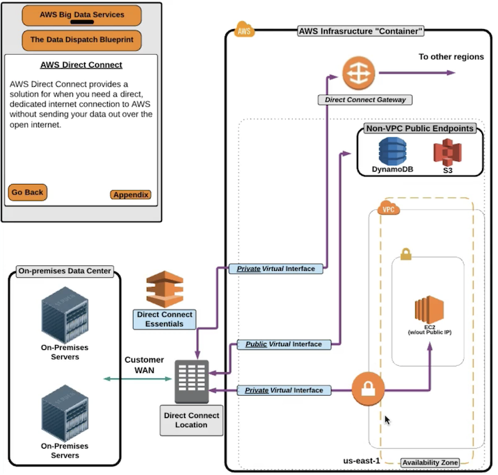

AWS Direct Connect Essentials
=============================

Provides a solution for when you need a direct, dedicated internet connection to AWS without sending your data over the open internet.

简单来说, 就是将你的私有数据中心和服务器, 与 AWS 直接连接, 不经过公共网络地传输数据. 需要 AWS 指定的几个 ISP (Internet Service Provider) 提供服务. 实际上就是 ISP 将你的网络转化为 AWS 指定的 Direct Connect 服务. 使用 DC 服务传输数据的费率比通过公网便宜.

Private Virtual Interface (PVI)
------------------------------------------------------------------------------

简单来说, 在 VPC 内部的 Resource, 比如 EC2, RDS, 他们的公网 IP 是无法访问的. 平时的情况需要连接到 位于 VPC 内的 Jumphost, 才能与之通信.

PVI 是 direct connect 的一个模块, 如果你处于 direct connect 的环境下, 则你可以使用公网 IP 访问位于 VPC 内部的 Resource, 而 PVI 会帮你处理 Route 的部分.

