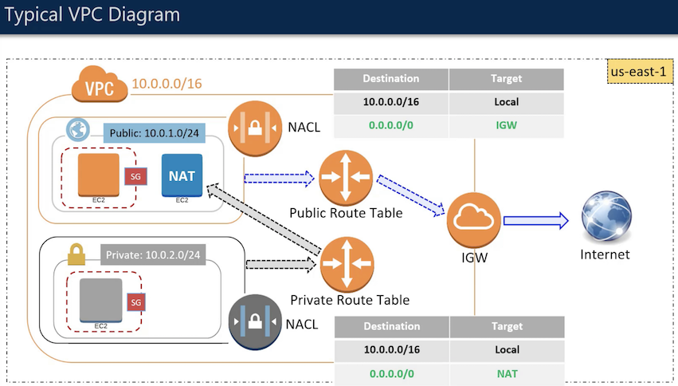

Course Outline
==============================================================================

.. contents::
    :depth: 1
    :local:

INTRODUCTION
------------------------------------------------------------------------------

.. contents::
    :depth: 1
    :local:

1. Welcome To The Course Free (Time: 00 Hour 03 Mins 39 Sec)
~~~~~~~~~~~~~~~~~~~~~~~~~~~~~~~~~~~~~~~~~~~~~~~~~~~~~~~~~~~~~~~~~~~~~~~~~~~~~~

2. About The Instructor (Time: 00 Hour 03 Mins 34 Sec)
~~~~~~~~~~~~~~~~~~~~~~~~~~~~~~~~~~~~~~~~~~~~~~~~~~~~~~~~~~~~~~~~~~~~~~~~~~~~~~

3. Why Cloud Computing? (Time: 00 Hour 06 Mins 44 Sec)
~~~~~~~~~~~~~~~~~~~~~~~~~~~~~~~~~~~~~~~~~~~~~~~~~~~~~~~~~~~~~~~~~~~~~~~~~~~~~~

4. Why AWS? (Time: 00 Hour 03 Mins 55 Sec)
~~~~~~~~~~~~~~~~~~~~~~~~~~~~~~~~~~~~~~~~~~~~~~~~~~~~~~~~~~~~~~~~~~~~~~~~~~~~~~

5. Overview Of AWS Services (Time: 00 Hour 05 Mins 13 Sec)
~~~~~~~~~~~~~~~~~~~~~~~~~~~~~~~~~~~~~~~~~~~~~~~~~~~~~~~~~~~~~~~~~~~~~~~~~~~~~~

GETTING STARTED WITH AWS
------------------------------------------------------------------------------

.. contents::
    :depth: 1
    :local:

1. Overview Of The Exam (Time: 00 Hour 05 Mins 52 Sec)
~~~~~~~~~~~~~~~~~~~~~~~~~~~~~~~~~~~~~~~~~~~~~~~~~~~~~~~~~~~~~~~~~~~~~~~~~~~~~~

2. Overview Of This Course (Time: 00 Hour 03 Mins 12 Sec)
~~~~~~~~~~~~~~~~~~~~~~~~~~~~~~~~~~~~~~~~~~~~~~~~~~~~~~~~~~~~~~~~~~~~~~~~~~~~~~

3. Setting Up Free-Tier AWS Account (Time: 00 Hour 04 Mins 01 Sec)
~~~~~~~~~~~~~~~~~~~~~~~~~~~~~~~~~~~~~~~~~~~~~~~~~~~~~~~~~~~~~~~~~~~~~~~~~~~~~~

4. Getting Familiar With AWS Console (Time: 00 Hour 09 Mins 31 Sec)
~~~~~~~~~~~~~~~~~~~~~~~~~~~~~~~~~~~~~~~~~~~~~~~~~~~~~~~~~~~~~~~~~~~~~~~~~~~~~~

IDENTITY AND ACCESS MANAGEMENT
------------------------------------------------------------------------------

.. contents::
    :depth: 1
    :local:

1. Introduction To IAM Free (Time: 00 Hour 07 Mins 18 Sec)
~~~~~~~~~~~~~~~~~~~~~~~~~~~~~~~~~~~~~~~~~~~~~~~~~~~~~~~~~~~~~~~~~~~~~~~~~~~~~~

2. Getting Started With IAM (Time: 00 Hour 10 Mins 46 Sec)
~~~~~~~~~~~~~~~~~~~~~~~~~~~~~~~~~~~~~~~~~~~~~~~~~~~~~~~~~~~~~~~~~~~~~~~~~~~~~~

3. IAM Users And IAM Groups (Time: 00 Hour 20 Mins 18 Sec)
~~~~~~~~~~~~~~~~~~~~~~~~~~~~~~~~~~~~~~~~~~~~~~~~~~~~~~~~~~~~~~~~~~~~~~~~~~~~~~

4. IAM Policies (Time: 00 Hour 14 Mins 07 Sec)
~~~~~~~~~~~~~~~~~~~~~~~~~~~~~~~~~~~~~~~~~~~~~~~~~~~~~~~~~~~~~~~~~~~~~~~~~~~~~~

Explicit Deny > Explicit Allow > Default Deny

5. IAM Roles (Time: 00 Hour 17 Mins 08 Sec)
~~~~~~~~~~~~~~~~~~~~~~~~~~~~~~~~~~~~~~~~~~~~~~~~~~~~~~~~~~~~~~~~~~~~~~~~~~~~~~

6. IAM Best Practices (Time: 00 Hour 06 Mins 22 Sec)
~~~~~~~~~~~~~~~~~~~~~~~~~~~~~~~~~~~~~~~~~~~~~~~~~~~~~~~~~~~~~~~~~~~~~~~~~~~~~~

7. IAM Summary (Time: 00 Hour 02 Mins 30 Sec)
~~~~~~~~~~~~~~~~~~~~~~~~~~~~~~~~~~~~~~~~~~~~~~~~~~~~~~~~~~~~~~~~~~~~~~~~~~~~~~

SIMPLE STORAGE SERVICE (S3)
------------------------------------------------------------------------------

.. contents::
    :depth: 1
    :local:

1. Introduction To S3 Free (Time: 00 Hour 05 Mins 58 Sec)
~~~~~~~~~~~~~~~~~~~~~~~~~~~~~~~~~~~~~~~~~~~~~~~~~~~~~~~~~~~~~~~~~~~~~~~~~~~~~~

2. Fundamentals (Time: 00 Hour 12 Mins 32 Sec)
~~~~~~~~~~~~~~~~~~~~~~~~~~~~~~~~~~~~~~~~~~~~~~~~~~~~~~~~~~~~~~~~~~~~~~~~~~~~~~

3. Object Storage Vs Block Storage (Time: 00 Hour 04 Mins 24 Sec)
~~~~~~~~~~~~~~~~~~~~~~~~~~~~~~~~~~~~~~~~~~~~~~~~~~~~~~~~~~~~~~~~~~~~~~~~~~~~~~

4. Getting Started With S3 (Time: 00 Hour 07 Mins 36 Sec)
~~~~~~~~~~~~~~~~~~~~~~~~~~~~~~~~~~~~~~~~~~~~~~~~~~~~~~~~~~~~~~~~~~~~~~~~~~~~~~

5. Versioning (Time: 00 Hour 15 Mins 48 Sec)
~~~~~~~~~~~~~~~~~~~~~~~~~~~~~~~~~~~~~~~~~~~~~~~~~~~~~~~~~~~~~~~~~~~~~~~~~~~~~~

6. Server Access Logging And Object Level Logging (Time: 00 Hour 11 Mins 57 Sec)
~~~~~~~~~~~~~~~~~~~~~~~~~~~~~~~~~~~~~~~~~~~~~~~~~~~~~~~~~~~~~~~~~~~~~~~~~~~~~~

7. Static Website Hosting Free (Time: 00 Hour 04 Mins 19 Sec)
~~~~~~~~~~~~~~~~~~~~~~~~~~~~~~~~~~~~~~~~~~~~~~~~~~~~~~~~~~~~~~~~~~~~~~~~~~~~~~

8. Encryption (Time: 00 Hour 11 Mins 39 Sec)
~~~~~~~~~~~~~~~~~~~~~~~~~~~~~~~~~~~~~~~~~~~~~~~~~~~~~~~~~~~~~~~~~~~~~~~~~~~~~~

9. Tags Transfer Acceleration And Multipart Upload (Time: 00 Hour 11 Mins 17 Sec)
~~~~~~~~~~~~~~~~~~~~~~~~~~~~~~~~~~~~~~~~~~~~~~~~~~~~~~~~~~~~~~~~~~~~~~~~~~~~~~

10. Events (Time: 00 Hour 07 Mins 34 Sec)
~~~~~~~~~~~~~~~~~~~~~~~~~~~~~~~~~~~~~~~~~~~~~~~~~~~~~~~~~~~~~~~~~~~~~~~~~~~~~~

11. Requester Pays (Time: 00 Hour 02 Mins 56 Sec)
~~~~~~~~~~~~~~~~~~~~~~~~~~~~~~~~~~~~~~~~~~~~~~~~~~~~~~~~~~~~~~~~~~~~~~~~~~~~~~

12. Permissions Access Control List And Bucket Policy (Time: 00 Hour 07 Mins 52 Sec)
~~~~~~~~~~~~~~~~~~~~~~~~~~~~~~~~~~~~~~~~~~~~~~~~~~~~~~~~~~~~~~~~~~~~~~~~~~~~~~

13. Object Lifecycle Management (Time: 00 Hour 09 Mins 37 Sec)
~~~~~~~~~~~~~~~~~~~~~~~~~~~~~~~~~~~~~~~~~~~~~~~~~~~~~~~~~~~~~~~~~~~~~~~~~~~~~~

14. Cross Region Replication (Time: 00 Hour 11 Mins 34 Sec)
~~~~~~~~~~~~~~~~~~~~~~~~~~~~~~~~~~~~~~~~~~~~~~~~~~~~~~~~~~~~~~~~~~~~~~~~~~~~~~

15. Analytics Metrics And Inventory (Time: 00 Hour 12 Mins 17 Sec)
~~~~~~~~~~~~~~~~~~~~~~~~~~~~~~~~~~~~~~~~~~~~~~~~~~~~~~~~~~~~~~~~~~~~~~~~~~~~~~

以下三个分析的选项都可以在 Bucket 界面看到.

S3 Analytics

S3 Metrics, CloudWatch metrics

S3 Inventory

16. Storage Classes (Time: 00 Hour 10 Mins 00 Sec)
~~~~~~~~~~~~~~~~~~~~~~~~~~~~~~~~~~~~~~~~~~~~~~~~~~~~~~~~~~~~~~~~~~~~~~~~~~~~~~

What are storage classes:

- S3 Stardard
- S3 Standard - Infrequent Access (S3 Standard-IA) and S3 One Zone-Infrequent Access (S3 One Zone-IA): Long-lived, but less frequently accessed data
- Glacier: Long-term archive

S3 Standard:

- Data is replicated across at least 3 different availability zones.
- Low latency and high throughput

S3 Standard IA:

- For data that is accessed less frequently, but requires rapid access when needed.
- Data is replicated across 3 different AZs for high durability and availability.
- Cost less than S3-Standard; charges you for retrieving the data per GB (Not based on request)

S3 One Zone IA:

- Same as Standard IA
- Stored in only a single availability zone (AZ)
- 20% less than S3 Standard-IA

Glacier:

Three options for retrieving the archives:

1. Standard
2. Expedited
3. Bulk

17. Select From (Time: 00 Hour 03 Mins 21 Sec)
~~~~~~~~~~~~~~~~~~~~~~~~~~~~~~~~~~~~~~~~~~~~~~~~~~~~~~~~~~~~~~~~~~~~~~~~~~~~~~

18. S3 Summary (Time: 00 Hour 07 Mins 55 Sec)
~~~~~~~~~~~~~~~~~~~~~~~~~~~~~~~~~~~~~~~~~~~~~~~~~~~~~~~~~~~~~~~~~~~~~~~~~~~~~~

EC2 AND EBS
------------------------------------------------------------------------------

.. contents::
    :depth: 1
    :local:

1. Introduction (Time: 00 Hour 00 Mins 59 Sec)
~~~~~~~~~~~~~~~~~~~~~~~~~~~~~~~~~~~~~~~~~~~~~~~~~~~~~~~~~~~~~~~~~~~~~~~~~~~~~~

2. Creating An EC2 Part I (Time: 00 Hour 08 Mins 12 Sec)
~~~~~~~~~~~~~~~~~~~~~~~~~~~~~~~~~~~~~~~~~~~~~~~~~~~~~~~~~~~~~~~~~~~~~~~~~~~~~~

Amazone Machine Image: Customizable VM Image

Virtualization Type:

- HVM: Hardware assisted Virtual Machine
- Paravirtualization

Root Device Type:

- EBS
- Instance store

Instance Type:

- T: general purpose
- C: compute optimized
- X: memory optimized
- P: accelerated computing
- H: storage optimized

3. Creating An EC2 Part II (Time: 00 Hour 11 Mins 35 Sec)
~~~~~~~~~~~~~~~~~~~~~~~~~~~~~~~~~~~~~~~~~~~~~~~~~~~~~~~~~~~~~~~~~~~~~~~~~~~~~~

Purchase Option:

On-Demand:

- pay as you go
- costliest option
- suitable when you are not sure about the capacity need beforehand. E.g. your application has sudden spike of traffic, short projects, R&D etc.

Reserved:

- Proactive type (有前瞻性的)
- You purchase the VMs beforehand.
- Earlier and longer the period for you reserve them, more is saves you the money
- Suitable for situations where you aware about the capacity needed. E.g. Minimum number of VMs needed to run your application smoothly

Scheduled:

Spot:

- Give me if available for this price type
- saves costs significantly
- in this option, you bid for the unused EC2 instance capacity of AWS
- if the actual price of that EC2 instance class becomes equal or less than the bid price, the instances get assigned to you at your bid price.
- However, if the actual price increases than your bid price, your instances may get terminated with a half an hour's notice. So, this options is little risky, since you might lose the instance in a short notice.
- Not that you will not be charged for that partial hour in which the instance was terminated.

spot terms:

- spot instance pool: which is a set of unused EC2 instance with same instance type, OS, AZ
- spot price
- spot instance request
- spot fleet: 用来 assign / launch EC2 的, 如果你的 bid 被接受的话
- spot instance interruption

Dedicated Instance / Dedicated Host:

- Hypervisor 是用来 run VM 的超级计算机
- Shared Instance: 每次你的 VM 可能会在不同的 Hypervisor 上跑
- Dedicated Instance: 每次你的 VM 在固定的几台 Hypervisor 上跑
- Dedicated Host: 每次你的 VM 在指定的一台 Hypervisor 上跑

4. Creating An EC2 Part III (Time: 00 Hour 15 Mins 32 Sec)
~~~~~~~~~~~~~~~~~~~~~~~~~~~~~~~~~~~~~~~~~~~~~~~~~~~~~~~~~~~~~~~~~~~~~~~~~~~~~~

Volumn Type:

1. General Purpose SSD
2. Provisioned IOPS SSD (Database Instance)
3. Magnetic HDD

还有:

4. Throughput Optimized HDD

- SSD-backed volumes are optimized and more suited for applications that require frequent read/write operation with small I/O size.
- HDD-backed volumes are more useful when the throughput (MiB/s) is more critical than IOPS

You can't attach one volume to multiple instance

EC2 Security Group:

- protects the instance by applying a security wall of rules (like a firewall)

5. Managing The EC2 Instance (Time: 00 Hour 09 Mins 54 Sec)
~~~~~~~~~~~~~~~~~~~~~~~~~~~~~~~~~~~~~~~~~~~~~~~~~~~~~~~~~~~~~~~~~~~~~~~~~~~~~~

Network Interface:

- A network interface is a component or a virtual network card that you can attach to an instance and detach from it so that it can be reattached to another instance
- A network interface has following properties or attributes:
    - a primary IPv4 address
    - one or more secondary private IPv4 addresses
    - One elastic IP address (IPv4)
    - One public IPv4 address
    - One or more IPv6 addresses
    - One or more security groups
    - A MAC address
    - A source/destination check flag
    - A description
- Every instance in a VPC has a default network interface, called the primary network interface (eth0).
- You cannot detach a primary network interface from an instance; but, you can create and attach additional network interfaces

6. AMI Image And Bundle Task (Time: 00 Hour 07 Mins 00 Sec)
~~~~~~~~~~~~~~~~~~~~~~~~~~~~~~~~~~~~~~~~~~~~~~~~~~~~~~~~~~~~~~~~~~~~~~~~~~~~~~

7. EBS Volume Snapshots Free (Time: 00 Hour 13 Mins 27 Sec)
~~~~~~~~~~~~~~~~~~~~~~~~~~~~~~~~~~~~~~~~~~~~~~~~~~~~~~~~~~~~~~~~~~~~~~~~~~~~~~

8. Instance Store And Placement Groups (Time: 00 Hour 06 Mins 54 Sec)
~~~~~~~~~~~~~~~~~~~~~~~~~~~~~~~~~~~~~~~~~~~~~~~~~~~~~~~~~~~~~~~~~~~~~~~~~~~~~~

Instance Store:

1. **temporary** block-level storage located on disks that are physically attached to the host computer

Placement Group:

1. arrangements of instances on the underlying hardware/hypervisor.
2. two types:
    - cluster: instances on a single hypervisor in single AZs
    - spread: each instance on a separate hypervisor in separate AZs

9. Summary (Time: 00 Hour 02 Mins 52 Sec)
~~~~~~~~~~~~~~~~~~~~~~~~~~~~~~~~~~~~~~~~~~~~~~~~~~~~~~~~~~~~~~~~~~~~~~~~~~~~~~

ELB & AUTOSCALING
------------------------------------------------------------------------------

.. contents::
    :depth: 1
    :local:

1. ELB Introduction (Time: 00 Hour 11 Mins 15 Sec)
~~~~~~~~~~~~~~~~~~~~~~~~~~~~~~~~~~~~~~~~~~~~~~~~~~~~~~~~~~~~~~~~~~~~~~~~~~~~~~

- Application Load Balancer: Http, Https
- Network Load Balancer: TPC/IP
- Classic Balancer

2. Application Load Balancing - Demo (Time: 00 Hour 32 Mins 47 Sec)
~~~~~~~~~~~~~~~~~~~~~~~~~~~~~~~~~~~~~~~~~~~~~~~~~~~~~~~~~~~~~~~~~~~~~~~~~~~~~~

- Listener
- rules: 比如 /picture 则送到 图像服务器, /request 则送到 App 服务器
- Health check
- Target and Target Group

3. Network Load Balancing - Demo (Time: 00 Hour 21 Mins 22 Sec)
~~~~~~~~~~~~~~~~~~~~~~~~~~~~~~~~~~~~~~~~~~~~~~~~~~~~~~~~~~~~~~~~~~~~~~~~~~~~~~

- Listener
- rules: 比如 :80 则送到 图像服务器, :8080 则送到 视频服务器
- Health check
- Target and Target Group

4. Autoscaling - Launch Configuration And Autoscaling Group (Time: 00 Hour 11 Mins 59 Sec)
~~~~~~~~~~~~~~~~~~~~~~~~~~~~~~~~~~~~~~~~~~~~~~~~~~~~~~~~~~~~~~~~~~~~~~~~~~~~~~

Autoscale 的机制:

设置3个重要参数 min / desired / max capacity 的 Copy

5. Autoscaling - Demo (Time: 00 Hour 08 Mins 51 Sec)
~~~~~~~~~~~~~~~~~~~~~~~~~~~~~~~~~~~~~~~~~~~~~~~~~~~~~~~~~~~~~~~~~~~~~~~~~~~~~~

6. Scheduled Scaling Demo (Time: 00 Hour 02 Mins 41 Sec)
~~~~~~~~~~~~~~~~~~~~~~~~~~~~~~~~~~~~~~~~~~~~~~~~~~~~~~~~~~~~~~~~~~~~~~~~~~~~~~

7. Lifecycle Of EC2 Instance And Lifecycle Hooks (Time: 00 Hour 03 Mins 12 Sec)
~~~~~~~~~~~~~~~~~~~~~~~~~~~~~~~~~~~~~~~~~~~~~~~~~~~~~~~~~~~~~~~~~~~~~~~~~~~~~~

8. EC2 Instance Termination Logic (Time: 00 Hour 02 Mins 26 Sec)
~~~~~~~~~~~~~~~~~~~~~~~~~~~~~~~~~~~~~~~~~~~~~~~~~~~~~~~~~~~~~~~~~~~~~~~~~~~~~~

CLOUDWATCH
------------------------------------------------------------------------------

.. contents::
    :depth: 1
    :local:

1. Overview (Time: 00 Hour 10 Mins 59 Sec)
~~~~~~~~~~~~~~~~~~~~~~~~~~~~~~~~~~~~~~~~~~~~~~~~~~~~~~~~~~~~~~~~~~~~~~~~~~~~~~

2. Dashboards And Alarms (Time: 00 Hour 10 Mins 29 Sec)
~~~~~~~~~~~~~~~~~~~~~~~~~~~~~~~~~~~~~~~~~~~~~~~~~~~~~~~~~~~~~~~~~~~~~~~~~~~~~~

3. ELB Monitoring (Time: 00 Hour 21 Mins 34 Sec)
~~~~~~~~~~~~~~~~~~~~~~~~~~~~~~~~~~~~~~~~~~~~~~~~~~~~~~~~~~~~~~~~~~~~~~~~~~~~~~

4. EBS Monitoring (Time: 00 Hour 13 Mins 36 Sec)
~~~~~~~~~~~~~~~~~~~~~~~~~~~~~~~~~~~~~~~~~~~~~~~~~~~~~~~~~~~~~~~~~~~~~~~~~~~~~~

5. EC2 Custom Metrics Monitoring (Time: 00 Hour 15 Mins 44 Sec)
~~~~~~~~~~~~~~~~~~~~~~~~~~~~~~~~~~~~~~~~~~~~~~~~~~~~~~~~~~~~~~~~~~~~~~~~~~~~~~

VPC
------------------------------------------------------------------------------

.. contents::
    :depth: 1
    :local:

1. VPC Basics (Time: 00 Hour 12 Mins 31 Sec)
~~~~~~~~~~~~~~~~~~~~~~~~~~~~~~~~~~~~~~~~~~~~~~~~~~~~~~~~~~~~~~~~~~~~~~~~~~~~~~

.. contents::
    :local:

Main components:

- Region
- CIDR (Classless Inter-Domain Routing)
- Subnets
- NAT Instance
- NAT Gateway
- Internet Gateway
- Route Table
- Security Group
- Network Access Control Lists
- Virtual Private Gateway
- Customer Gateway
- Dynamic Host Control Protocol (DHCP)
- IP Address

Region
++++++++++++++++++++++++++++++++++++++++++++++++++++++++++++++++++++++++++++++

- A VPC belongs to a single region
- you can create multiple VPC in a single region

CIDR
++++++++++++++++++++++++++++++++++++++++++++++++++++++++++++++++++++++++++++++
- Stands for Classless Inter-Domain Routing
- When you create a VPC, you must specify a range of IPv4 address for the VPC in the form of CIDR block; e.g. 10.0.0.0/16 (primary CIDR block)
- CIDR is just a method for allocating IP address and IP routine
- CIDR notation is a compact representation of an IP address and its associated routine prefix. E.g. 10.0.0.0/24 represent the IP address of 10.0.0.0. its subnet mask is 255.255.255.0, which has 24 leading 1 bits, and its associated routine prefix
- in this example, you will have 2 ** (32 - 24) = 256 address available

Subnets
++++++++++++++++++++++++++++++++++++++++++++++++++++++++++++++++++++++++++++++
- a subnet is just a part of the VPC that also has a CIDR block
- a VPC can span multiple AZ, a subnet can only be inside a single AZ
- you need to create one or more subnets inside your VPC to be able to launch the instance
- typically you will create a private subnets - which contains resources that not exposed to internet or outside of the VPC
- typically you will also create a public subnets - which contains resource that have access to the internet or reachable from internet
- the subnets inside a VPC cannot have overlapping IP address

NAT Instance (Network Address Translation)
++++++++++++++++++++++++++++++++++++++++++++++++++++++++++++++++++++++++++++++
- it is a mechanism which contains a physical device acting as a mediator between the instances inside the network and internet.
- When an instance from inside network requests for information from say a website, the NAT device keeps track of the private IP address of the instance, and makes a request to the website with its own public IP address, giving the impression that it is the NAT who is requesting the website. Once the reply comes back from internet, the NAT checks which instance had made the request, and returns the information to it. So, the private IP address of the instance never gets exposed to the internet. This is called as network address translation.
- It is just an EC2 instance with NAT capability which stays in a public subnet. All private instances go through NAT if they want to access internet.

NAT Gateway
++++++++++++++++++++++++++++++++++++++++++++++++++++++++++++++++++++++++++++++
- A NAT gateway is an AWS managed NAT device.
- a Highly available and scalable solution from AWS.
- Reduces the need for the provisioning of the NAT instance by the customer.

Internet Gateway (IGW)
++++++++++++++++++++++++++++++++++++++++++++++++++++++++++++++++++++++++++++++
- A horizontally scaled, redundant, and highly available VPC component that allows communication between instances in your VPC and the internet.
- Serves two purposes: to provide a target in your VPC route tables for internet-routable traffic, and to perform network address translation (NAT) for instances that have been assigned public IPv4 addresses.

NAT Gateway vs IGW
++++++++++++++++++++++++++++++++++++++++++++++++++++++++++++++++++++++++++++++
NAT Gateway works at the subnet level whereas IGW works at the VPC level.

Route Table
++++++++++++++++++++++++++++++++++++++++++++++++++++++++++++++++++++++++++++++
- Contains a set of rules, called routes, that are used to determine where network traffic is directed.
- Each route in a table specifies a destination CIDR and a target
- Each subnet must be associated with a route table, which controls the routing for the subnet. If you don't explicitly associate a subnet with a particular route table, the subnet is implicitly associated with the main route table.
- You cannot delete the main route table, but you can replace the main route table with a custom table.
- Every route table contains a local route for communication within the VPC over IPv4.
- When you add an Internet gateway, an egress-only Internet gateway, a virtual private gateway, a NAT device, a peering connection, or a VPC endpoint in your VPC, you must update the route table for any subnet that uses these gateways or connections.

Security Group
++++++++++++++++++++++++++++++++++++++++++++++++++++++++++++++++++++++++++++++
- Security groups work at the instance level. Hence they are the first layer of defence for an instance.
- As seen during EC2 section, security groups define which port and protocols are allowed for incoming and outgoing traffic for the instance.
- Remember that SGs are stateful. I.e. if a port is open for an inbound traffic, the outbound traffic on the same port is allowed automatically.
- You can only allow, but can not explicitly deny.

Network Access Control Lists (NACL)
++++++++++++++++++++++++++++++++++++++++++++++++++++++++++++++++++++++++++++++
- Network Access Control Lists work at the subnet level. Hence they are second layer of defense.
- As opposed to Security Groups, NACLs are stateless. I.e. if a port is open for inbound traffic, the corresponding outbound traffic is not enabled automatically.
- NACL consists of ordered rules - which contain
    - Rule number
    - Protocol
    - The source of the traffic (CIDR range) and the destination (listening) port or port range [Inbound rules only]
    - The destination for the traffic (CIDR range) and the destination port or port range [Outbound rules only]
    - Choice of ALLOW or DENY for the specified traffic

2. Setting Up VPC (Time: 00 Hour 17 Mins 16 Sec)
~~~~~~~~~~~~~~~~~~~~~~~~~~~~~~~~~~~~~~~~~~~~~~~~~~~~~~~~~~~~~~~~~~~~~~~~~~~~~~

A typical VPC diagram

在 VPC 的控制台上最重要的几个:

1. VPC:
2. Subnet:
3. Route Tables:
4. Internet Gateways (IGW): 为 VPC 提供公共英特网的连接服务, VPC 连接外网的流量都要通过 IGW. 如果你的 VPC 要访问外网, 则创建 VPC 之后就要创建一个 IGW.
5. NAT Gateways: 是位于外网和内网设备之间, 用于为内网设备提供安全的外网访问的设备. 当内网设备需要从外网下载东西时, 则发送请求给 NAT Gateways, 然后 NAT 收到下载数据后, 再转发给内网设备, 使得内网设备的 IP 等信息不会泄露给外网. NAT 的服务对象是 Subnet, 一个 NAT 只能服务于一个 Subnet. NAT Gateways 的实现方式可以使用 AWS 的抽象 NAT Gateways 服务, 也可以用 NAT Instance, 一台专用的 EC2.
6. Network ACLs: 一系列网络 Inbound, Outbound, Protocol 的规则. 针对 NAT Gateways.
7. Security Group: 和 Network ACL 类似, 不过是针对 AWS Resource, 比如 EC2, RDS.

3. Create VPCFrom Wizard (Time: 00 Hour 10 Mins 36 Sec)
~~~~~~~~~~~~~~~~~~~~~~~~~~~~~~~~~~~~~~~~~~~~~~~~~~~~~~~~~~~~~~~~~~~~~~~~~~~~~~

What is Elastic IP (EIP):

EIP = 弹性IP地址.

事实: 每次启动 EC2 实例时, AWS 自动第为每个实例分配一个 private IP 地址 和 public IP 地址.

假设你有一个 Web APP 运行在这个实例上, 你为这个实例的 public IP 购买了一个域名, 并在 DNS 服务商处注册了. 但是每次关闭再启动实例后, public IP 都会变. 即使你能够动态地将新的 IP 映射到你的域名, 但是将变化传播到整个互联网的时间可能长达 24 小时. 为了解决这个问题, AWS 引入了弹性 IP 的概念. 弹性IP地址是与你的 AWS 账户关联的静态 IP, 除非你显示地释放它, 不然它一直是你的.

4. NAT Instance Vs NAT Gateway (Time: 00 Hour 02 Mins 49 Sec)
~~~~~~~~~~~~~~~~~~~~~~~~~~~~~~~~~~~~~~~~~~~~~~~~~~~~~~~~~~~~~~~~~~~~~~~~~~~~~~

NAT Instance vs NAT Gateway

NAT Instance:

- PROS: Customizable, User in control of creating and managing, Multiple instances needed to be highly available and scalable
- Can become single point of failure
- Flexibility in the size and type
- Can be used as a Bastian Server (堡垒服务器)
- Port Forwarding is supported
- Supports reassembly of IP fragmented packets for the UDP, TCP, and ICMP protocols.

NAT Gateway:

- PROS: Managed by AWS, implicitly highly available and scalable
- Least likely to be a single point of failure
- Uniform offering by AWS
- Cannot be used as a Bastian Server
- Port Forwarding is not supported
- Does not support fragmentation for the TCP and ICMP protocols. Fragmented packets for these protocols will get dropped.

5. VPC Peering And VPC Endpoints (Time: 00 Hour 07 Mins 57 Sec)
~~~~~~~~~~~~~~~~~~~~~~~~~~~~~~~~~~~~~~~~~~~~~~~~~~~~~~~~~~~~~~~~~~~~~~~~~~~~~~

- A VPC peering connection is a networking connection between two VPCs that enables you to route traffic between them using private IPv4 addresses or IPv6 addresses.
- Can be created between your own VPCs, with a VPC in another AWS account, or with a VPC in a different AWS Region.
- AWS uses the existing infrastructure of a VPC to create a VPC peering connection; it is neither a gateway nor a VPN connection, and does not rely on a separate piece of physical hardware.
- There is no single point of failure for communication or a bandwidth bottleneck.
- Helps facilitating the transfer of data. ( ) You cannot edit the VPC peering connection once it is created.
- You cannot attach or detach VPC peering connection.

应用场景:

1. 你有很多EC2, 需要从公网上下载补丁, 升级软件, 安装依赖包. 但是这些用于生产的服务器所在的 VPC 不能连接公网. 这时就可以用一个单独的, 可连接公网的 VPC 作为中转. 让这个 VPC 从公网上下载依赖, 并测试. 将该 VPC 和生产服务器所在的 VPC peering 起来, 并从已经测试好的服务器上下载安装依赖.

6. VPC Flow Logs (Time: 00 Hour 15 Mins 14 Sec)
~~~~~~~~~~~~~~~~~~~~~~~~~~~~~~~~~~~~~~~~~~~~~~~~~~~~~~~~~~~~~~~~~~~~~~~~~~~~~~

DATABASES
------------------------------------------------------------------------------

.. contents::
    :depth: 1
    :local:

1. Creating An RDS Instance (Time: 00 Hour 20 Mins 07 Sec)
~~~~~~~~~~~~~~~~~~~~~~~~~~~~~~~~~~~~~~~~~~~~~~~~~~~~~~~~~~~~~~~~~~~~~~~~~~~~~~

2. RDS - Multi-AZ Deployment (Time: 00 Hour 02 Mins 32 Sec)
~~~~~~~~~~~~~~~~~~~~~~~~~~~~~~~~~~~~~~~~~~~~~~~~~~~~~~~~~~~~~~~~~~~~~~~~~~~~~~

3. RDS - Read Replicas (Time: 00 Hour 07 Mins 02 Sec)
~~~~~~~~~~~~~~~~~~~~~~~~~~~~~~~~~~~~~~~~~~~~~~~~~~~~~~~~~~~~~~~~~~~~~~~~~~~~~~

4. RDS - Multi-AZ Vs Read Replicas (Time: 00 Hour 01 Mins 33 Sec)
~~~~~~~~~~~~~~~~~~~~~~~~~~~~~~~~~~~~~~~~~~~~~~~~~~~~~~~~~~~~~~~~~~~~~~~~~~~~~~

5. RTO And RPO (Time: 00 Hour 01 Mins 00 Sec)
~~~~~~~~~~~~~~~~~~~~~~~~~~~~~~~~~~~~~~~~~~~~~~~~~~~~~~~~~~~~~~~~~~~~~~~~~~~~~~

6. Connecting To RDS Instance Via Workbench (Time: 00 Hour 07 Mins 41 Sec)
~~~~~~~~~~~~~~~~~~~~~~~~~~~~~~~~~~~~~~~~~~~~~~~~~~~~~~~~~~~~~~~~~~~~~~~~~~~~~~

7. Redshift (Time: 00 Hour 04 Mins 41 Sec)
~~~~~~~~~~~~~~~~~~~~~~~~~~~~~~~~~~~~~~~~~~~~~~~~~~~~~~~~~~~~~~~~~~~~~~~~~~~~~~

8. SQL Vs NoSQL (Time: 00 Hour 03 Mins 21 Sec)
~~~~~~~~~~~~~~~~~~~~~~~~~~~~~~~~~~~~~~~~~~~~~~~~~~~~~~~~~~~~~~~~~~~~~~~~~~~~~~

9. DynamoDB - Tables, Item, Attributes, And Indexes (Time: 00 Hour 09 Mins 30 Sec)
~~~~~~~~~~~~~~~~~~~~~~~~~~~~~~~~~~~~~~~~~~~~~~~~~~~~~~~~~~~~~~~~~~~~~~~~~~~~~~

10. Global Secondary Index Vs Local Secondary Index (Time: 00 Hour 01 Mins 13 Sec)
~~~~~~~~~~~~~~~~~~~~~~~~~~~~~~~~~~~~~~~~~~~~~~~~~~~~~~~~~~~~~~~~~~~~~~~~~~~~~~

11. Read Consistency And Throughput Capacity (Time: 00 Hour 07 Mins 40 Sec)
~~~~~~~~~~~~~~~~~~~~~~~~~~~~~~~~~~~~~~~~~~~~~~~~~~~~~~~~~~~~~~~~~~~~~~~~~~~~~~

12. Autoscaling (Time: 00 Hour 01 Mins 51 Sec)
~~~~~~~~~~~~~~~~~~~~~~~~~~~~~~~~~~~~~~~~~~~~~~~~~~~~~~~~~~~~~~~~~~~~~~~~~~~~~~

13. Encryption (Time: 00 Hour 01 Mins 27 Sec)
~~~~~~~~~~~~~~~~~~~~~~~~~~~~~~~~~~~~~~~~~~~~~~~~~~~~~~~~~~~~~~~~~~~~~~~~~~~~~~

14. Query Vs Scan (Time: 00 Hour 02 Mins 24 Sec)
~~~~~~~~~~~~~~~~~~~~~~~~~~~~~~~~~~~~~~~~~~~~~~~~~~~~~~~~~~~~~~~~~~~~~~~~~~~~~~

15. DynamoDB Streams (Time: 00 Hour 03 Mins 20 Sec)
~~~~~~~~~~~~~~~~~~~~~~~~~~~~~~~~~~~~~~~~~~~~~~~~~~~~~~~~~~~~~~~~~~~~~~~~~~~~~~

16. DynamoDB Accelerator (Time: 00 Hour 01 Mins 22 Sec)
~~~~~~~~~~~~~~~~~~~~~~~~~~~~~~~~~~~~~~~~~~~~~~~~~~~~~~~~~~~~~~~~~~~~~~~~~~~~~~

ROUTE53
------------------------------------------------------------------------------

.. contents::
    :depth: 1
    :local:

1. Basics (Time: 00 Hour 11 Mins 58 Sec)
~~~~~~~~~~~~~~~~~~~~~~~~~~~~~~~~~~~~~~~~~~~~~~~~~~~~~~~~~~~~~~~~~~~~~~~~~~~~~~

Important Concept:

- Domain Name: google.com
- Top Level Domain (TLD): .com / .gov 这类的后缀
- Subdomain: google.com / maps.google.com / images.google.com 这类的共享一个根域名的域名.
- Domain Registrar: 一些特定的国际大公司, 有权利帮你注册某些域名.
- Domain Registry: 域名拥有者, 也就是找 Registrar 花钱注册了该域名的公司或人.
- Name Servers: 具体的某台服务器, 用于将你的 Domain Name 翻译成 IP 地址
- Authoritative Name Server: 根服务器, 负责某个区域, 比如北美, 亚洲的域名解析.
- DNS Resolver: 通常是 ISP (Internet Service Provider) 互联网服务提供商管理的服务器, 位于用户和 Name Server 之间.
- DNS Query
- DNS Record: 一系列具体的 domain name 到 IP 的对应关系. 相当于是多个 ``A Record``
- Time to Live (TTL): DNS Server 上 DNS Query 的缓存持续时间
- A Record:
- CNAME (Canonical Name 权威的) Record: 一个 domain / subdomain 到另一个 domain / subdomain 之间的映射
- Alias Record: AWS Route 53 的自定义 映射
- Zone Apex: Root Domain, google.com, amazon.com
- Routing Policy: A setting for domain that determine how Route 53 responds to DNS queries and route the traffic.

2. Registering A Domain (Time: 00 Hour 02 Mins 06 Sec)
~~~~~~~~~~~~~~~~~~~~~~~~~~~~~~~~~~~~~~~~~~~~~~~~~~~~~~~~~~~~~~~~~~~~~~~~~~~~~~

3. Simple Routing Policy - Demo (Time: 00 Hour 10 Mins 57 Sec)
~~~~~~~~~~~~~~~~~~~~~~~~~~~~~~~~~~~~~~~~~~~~~~~~~~~~~~~~~~~~~~~~~~~~~~~~~~~~~~

4. Weighted Routing Policy - Demo (Time: 00 Hour 08 Mins 39 Sec)
~~~~~~~~~~~~~~~~~~~~~~~~~~~~~~~~~~~~~~~~~~~~~~~~~~~~~~~~~~~~~~~~~~~~~~~~~~~~~~

5. Latency Routing Policy - Demo (Time: 00 Hour 08 Mins 17 Sec)
~~~~~~~~~~~~~~~~~~~~~~~~~~~~~~~~~~~~~~~~~~~~~~~~~~~~~~~~~~~~~~~~~~~~~~~~~~~~~~

6. Geographical Routing Policy - Demo (Time: 00 Hour 08 Mins 32 Sec)
~~~~~~~~~~~~~~~~~~~~~~~~~~~~~~~~~~~~~~~~~~~~~~~~~~~~~~~~~~~~~~~~~~~~~~~~~~~~~~

7. Failover Routing Policy - Demo (Time: 00 Hour 09 Mins 07 Sec)
~~~~~~~~~~~~~~~~~~~~~~~~~~~~~~~~~~~~~~~~~~~~~~~~~~~~~~~~~~~~~~~~~~~~~~~~~~~~~~

8. Multivalue Answer Routing Policy - Demo (Time: 00 Hour 07 Mins 16 Sec)
~~~~~~~~~~~~~~~~~~~~~~~~~~~~~~~~~~~~~~~~~~~~~~~~~~~~~~~~~~~~~~~~~~~~~~~~~~~~~~

ADDITIONAL KEY SERVICES
------------------------------------------------------------------------------

.. contents::
    :depth: 1
    :local:

1. Snowball (Time: 00 Hour 04 Mins 40 Sec)
~~~~~~~~~~~~~~~~~~~~~~~~~~~~~~~~~~~~~~~~~~~~~~~~~~~~~~~~~~~~~~~~~~~~~~~~~~~~~~

2. AWS Kinesis (Time: 00 Hour 12 Mins 39 Sec)
~~~~~~~~~~~~~~~~~~~~~~~~~~~~~~~~~~~~~~~~~~~~~~~~~~~~~~~~~~~~~~~~~~~~~~~~~~~~~~

3. CloudFront Overview (Time: 00 Hour 05 Mins 18 Sec)
~~~~~~~~~~~~~~~~~~~~~~~~~~~~~~~~~~~~~~~~~~~~~~~~~~~~~~~~~~~~~~~~~~~~~~~~~~~~~~

4. CloudFront Lab (Time: 00 Hour 19 Mins 37 Sec)
~~~~~~~~~~~~~~~~~~~~~~~~~~~~~~~~~~~~~~~~~~~~~~~~~~~~~~~~~~~~~~~~~~~~~~~~~~~~~~

5. KMS & CloudHSM (Time: 00 Hour 13 Mins 39 Sec)
~~~~~~~~~~~~~~~~~~~~~~~~~~~~~~~~~~~~~~~~~~~~~~~~~~~~~~~~~~~~~~~~~~~~~~~~~~~~~~

6. Elastic MapReduce(EMR) (Time: 00 Hour 18 Mins 11 Sec)
~~~~~~~~~~~~~~~~~~~~~~~~~~~~~~~~~~~~~~~~~~~~~~~~~~~~~~~~~~~~~~~~~~~~~~~~~~~~~~

7. AWS Athena (Time: 00 Hour 09 Mins 53 Sec)
~~~~~~~~~~~~~~~~~~~~~~~~~~~~~~~~~~~~~~~~~~~~~~~~~~~~~~~~~~~~~~~~~~~~~~~~~~~~~~

8. EFS (Time: 00 Hour 09 Mins 21 Sec)
~~~~~~~~~~~~~~~~~~~~~~~~~~~~~~~~~~~~~~~~~~~~~~~~~~~~~~~~~~~~~~~~~~~~~~~~~~~~~~

9. Elasticache (Time: 00 Hour 04 Mins 34 Sec)
~~~~~~~~~~~~~~~~~~~~~~~~~~~~~~~~~~~~~~~~~~~~~~~~~~~~~~~~~~~~~~~~~~~~~~~~~~~~~~

10. CloudFormation (Time: 00 Hour 18 Mins 47 Sec)
~~~~~~~~~~~~~~~~~~~~~~~~~~~~~~~~~~~~~~~~~~~~~~~~~~~~~~~~~~~~~~~~~~~~~~~~~~~~~~

11. OpsWork (Time: 00 Hour 04 Mins 30 Sec)
~~~~~~~~~~~~~~~~~~~~~~~~~~~~~~~~~~~~~~~~~~~~~~~~~~~~~~~~~~~~~~~~~~~~~~~~~~~~~~

12. AWS Direct Connect (Time: 00 Hour 04 Mins 43 Sec)
~~~~~~~~~~~~~~~~~~~~~~~~~~~~~~~~~~~~~~~~~~~~~~~~~~~~~~~~~~~~~~~~~~~~~~~~~~~~~~

13. AWS Lambda (Time: 00 Hour 18 Mins 48 Sec)
~~~~~~~~~~~~~~~~~~~~~~~~~~~~~~~~~~~~~~~~~~~~~~~~~~~~~~~~~~~~~~~~~~~~~~~~~~~~~~

14. ElasticBeanstalk (Time: 00 Hour 17 Mins 06 Sec)
~~~~~~~~~~~~~~~~~~~~~~~~~~~~~~~~~~~~~~~~~~~~~~~~~~~~~~~~~~~~~~~~~~~~~~~~~~~~~~

15. TrustedAdvisor (Time: 00 Hour 03 Mins 41 Sec)
~~~~~~~~~~~~~~~~~~~~~~~~~~~~~~~~~~~~~~~~~~~~~~~~~~~~~~~~~~~~~~~~~~~~~~~~~~~~~~

16. CloudTrail (Time: 00 Hour 11 Mins 31 Sec)
~~~~~~~~~~~~~~~~~~~~~~~~~~~~~~~~~~~~~~~~~~~~~~~~~~~~~~~~~~~~~~~~~~~~~~~~~~~~~~

17. WAF And Shield (Time: 00 Hour 07 Mins 38 Sec)
~~~~~~~~~~~~~~~~~~~~~~~~~~~~~~~~~~~~~~~~~~~~~~~~~~~~~~~~~~~~~~~~~~~~~~~~~~~~~~

18. SQS, SNS And SWF
Time: 00 Hour 12 Mins 48 Sec