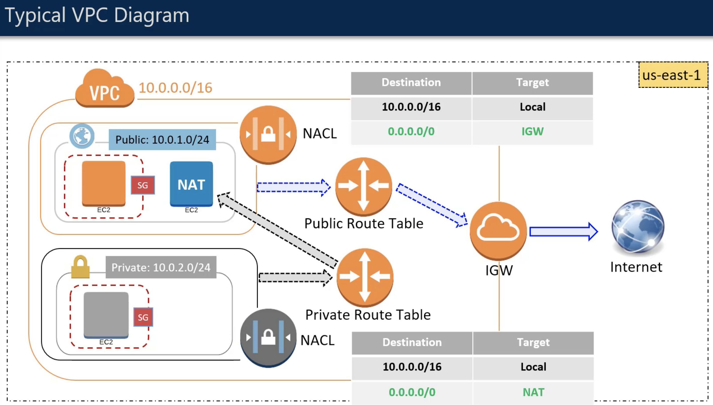

.. contents::
    :local:

Main components:

- Region
- CIDR (Classless Inter-Domain Routing)
- Subnets
- NAT Instance
- NAT Gateway
- Internet Gateway
- Route Table
- Security Group
- Network Access Control Lists
- Virtual Private Gateway
- Customer Gateway
- Dynamic Host Control Protocol (DHCP)
- IP Address

A typical VPC diagram

Region
++++++++++++++++++++++++++++++++++++++++++++++++++++++++++++++++++++++++++++++

- A VPC belongs to a single region
- you can create multiple VPC in a single region

CIDR
++++++++++++++++++++++++++++++++++++++++++++++++++++++++++++++++++++++++++++++
- Stands for Classless Inter-Domain Routing
- When you create a VPC, you must specify a range of IPv4 address for the VPC in the form of CIDR block; e.g. 10.0.0.0/16 (primary CIDR block)
- CIDR is just a method for allocating IP address and IP routine
- CIDR notation is a compact representation of an IP address and its associated routine prefix. E.g. 10.0.0.0/24 represent the IP address of 10.0.0.0. its subnet mask is 255.255.255.0, which has 24 leading 1 bits, and its associated routine prefix
- in this example, you will have 2 ** (32 - 24) = 256 address available

Subnets
++++++++++++++++++++++++++++++++++++++++++++++++++++++++++++++++++++++++++++++
- a subnet is just a part of the VPC that also has a CIDR block
- a VPC can span multiple AZ, a subnet can only be inside a single AZ
- you need to create one or more subnets inside your VPC to be able to launch the instance
- typically you will create a private subnets - which contains resources that not exposed to internet or outside of the VPC
- typically you will also create a public subnets - which contains resource that have access to the internet or reachable from internet
- the subnets inside a VPC cannot have overlapping IP address

NAT Instance (Network Address Translation)
++++++++++++++++++++++++++++++++++++++++++++++++++++++++++++++++++++++++++++++
- it is a mechanism which contains a physical device acting as a mediator between the instances inside the network and internet.
- When an instance from inside network requests for information from say a website, the NAT device keeps track of the private IP address of the instance, and makes a request to the website with its own public IP address, giving the impression that it is the NAT who is requesting the website. Once the reply comes back from internet, the NAT checks which instance had made the request, and returns the information to it. So, the private IP address of the instance never gets exposed to the internet. This is called as network address translation.
- It is just an EC2 instance with NAT capability which stays in a public subnet. All private instances go through NAT if they want to access internet.

NAT Gateway
++++++++++++++++++++++++++++++++++++++++++++++++++++++++++++++++++++++++++++++
- A NAT gateway is an AWS managed NAT device.
- a Highly available and scalable solution from AWS.
- Reduces the need for the provisioning of the NAT instance by the customer.

Internet Gateway (IGW)
++++++++++++++++++++++++++++++++++++++++++++++++++++++++++++++++++++++++++++++
- A horizontally scaled, redundant, and highly available VPC component that allows communication between instances in your VPC and the internet.
- Serves two purposes: to provide a target in your VPC route tables for internet-routable traffic, and to perform network address translation (NAT) for instances that have been assigned public IPv4 addresses.

NAT Gateway vs IGW
++++++++++++++++++++++++++++++++++++++++++++++++++++++++++++++++++++++++++++++
NAT Gateway works at the subnet level whereas IGW works at the VPC level.

Route Table
++++++++++++++++++++++++++++++++++++++++++++++++++++++++++++++++++++++++++++++
- Contains a set of rules, called routes, that are used to determine where network traffic is directed.
- Each route in a table specifies a destination CIDR and a target
- Each subnet must be associated with a route table, which controls the routing for the subnet. If you don't explicitly associate a subnet with a particular route table, the subnet is implicitly associated with the main route table.
- You cannot delete the main route table, but you can replace the main route table with a custom table.
- Every route table contains a local route for communication within the VPC over IPv4.
- When you add an Internet gateway, an egress-only Internet gateway, a virtual private gateway, a NAT device, a peering connection, or a VPC endpoint in your VPC, you must update the route table for any subnet that uses these gateways or connections.

Security Group
++++++++++++++++++++++++++++++++++++++++++++++++++++++++++++++++++++++++++++++
- Security groups work at the instance level. Hence they are the first layer of defence for an instance.
- As seen during EC2 section, security groups define which port and protocols are allowed for incoming and outgoing traffic for the instance.
- Remember that SGs are stateful. I.e. if a port is open for an inbound traffic, the outbound traffic on the same port is allowed automatically.
- You can only allow, but can not explicitly deny.

Network Access Control Lists (NACL)
++++++++++++++++++++++++++++++++++++++++++++++++++++++++++++++++++++++++++++++
- Network Access Control Lists work at the subnet level. Hence they are second layer of defense.
- As opposed to Security Groups, NACLs are stateless. I.e. if a port is open for inbound traffic, the corresponding outbound traffic is not enabled automatically.
- NACL consists of ordered rules - which contain
    - Rule number
    - Protocol
    - The source of the traffic (CIDR range) and the destination (listening) port or port range [Inbound rules only]
    - The destination for the traffic (CIDR range) and the destination port or port range [Outbound rules only]
    - Choice of ALLOW or DENY for the specified traffic
